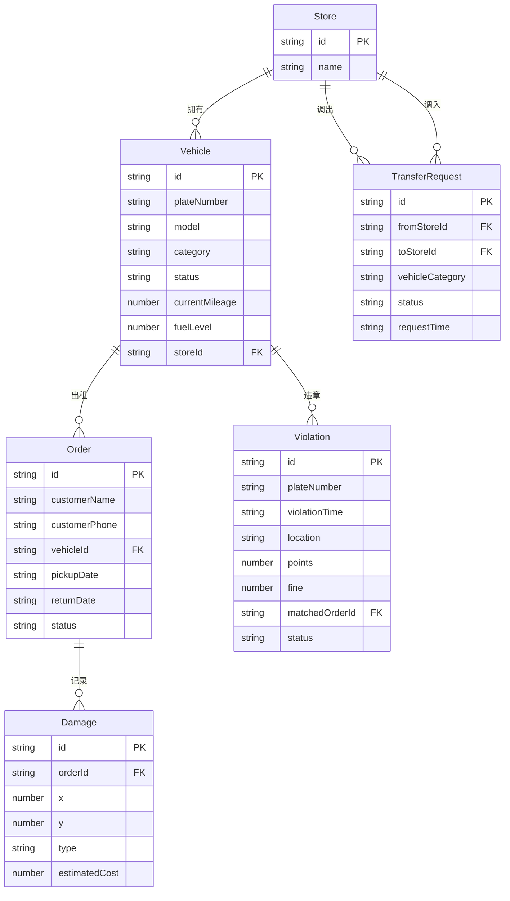

## 1. 架构设计

```mermaid
graph TB
    "前端 Vue3+TS" --> "路由 vue-router"
    "路由 vue-router" --> "运营仪表盘"
    "路由 vue-router" --> "还车管理"
    "路由 vue-router" --> "违章管理"
    "路由 vue-router" --> "调车管理"
    "运营仪表盘" --> "模拟数据层"
    "还车管理" --> "模拟数据层"
    "违章管理" --> "模拟数据层"
    "调车管理" --> "模拟数据层"
    "模拟数据层" --> "localStorage持久化"
```

纯前端项目，无后端服务，所有数据使用模拟数据 + localStorage 持久化。

## 2. 技术说明

- **前端**：Vue3 + TypeScript + Tailwind CSS + Vite
- **初始化工具**：vite-init（vue-ts 模板）
- **路由**：vue-router@4
- **状态管理**：Vue3 Composition API + reactive/ref（无需 Pinia，数据量适中）
- **图标**：lucide-vue-next
- **后端**：无（纯前端模拟）
- **数据库**：无（localStorage 模拟持久化）

## 3. 路由定义

| 路由 | 用途 |
|------|------|
| / | 运营仪表盘（默认页），含今日指标卡片和预约日历 |
| /return | 还车管理，还车验车操作流程 |
| /violation | 违章管理，违章导入、匹配、通知 |
| /transfer | 调车管理，门店间调车申请与记录 |

## 4. API定义

无后端API，使用模拟数据模块。

### 数据接口定义

```typescript
interface Vehicle {
  id: string
  plateNumber: string
  model: string
  category: string
  status: 'available' | 'rented' | 'maintenance' | 'transferring'
  currentMileage: number
  fuelLevel: number
  storeId: string
}

interface Order {
  id: string
  customerName: string
  customerPhone: string
  vehicleId: string
  plateNumber: string
  vehicleModel: string
  pickupDate: string
  returnDate: string
  actualReturnDate?: string
  returnMileage?: number
  returnFuelLevel?: number
  status: 'reserved' | 'active' | 'returned' | 'overdue'
  damages?: Damage[]
  extraCharges?: number
}

interface Damage {
  id: string
  x: number
  y: number
  type: 'scratch' | 'dent' | 'paint' | 'crack'
  estimatedCost: number
  description?: string
}

interface Violation {
  id: string
  plateNumber: string
  violationTime: string
  location: string
  points: number
  fine: number
  matchedOrderId?: string
  matchedCustomer?: string
  status: 'pending' | 'matched' | 'notified' | 'processing' | 'completed'
  handlingMethod?: 'self' | 'agency'
}

interface TransferRequest {
  id: string
  fromStoreId: string
  fromStoreName: string
  toStoreId: string
  toStoreName: string
  vehicleCategory: string
  vehicleId?: string
  status: 'pending' | 'approved' | 'in_transit' | 'completed'
  requestTime: string
  approvedTime?: string
  arrivalTime?: string
  handler?: string
}

interface Store {
  id: string
  name: string
}
```

## 5. 服务端架构图

不适用（纯前端项目）

## 6. 数据模型

### 6.1 数据模型定义



### 6.2 数据定义语言

使用 TypeScript 类型定义 + 模拟数据 JSON，存储于 `src/mock/` 目录下，应用启动时初始化到 localStorage。
